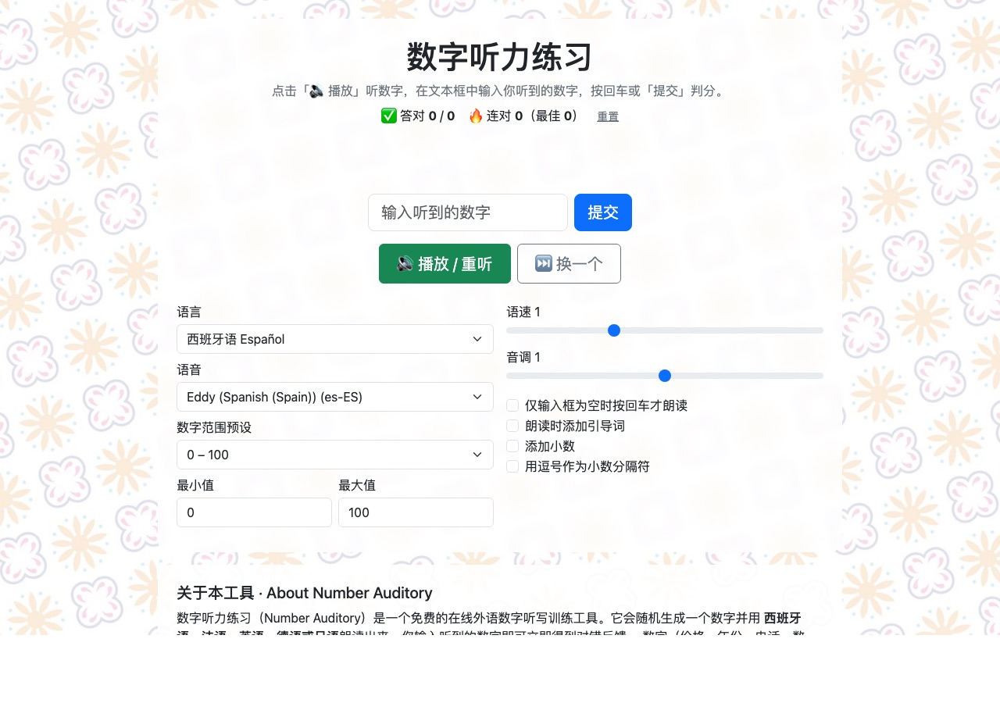

[English](README.md) | **中文**

# 数字听力练习 Number Auditory

> 🌐 **在线使用：** <https://numbers.snownamida.top/>

免费的多语言**数字听力（数字听写）练习工具**：随机生成一个数字，用外语朗读出来，你输入听到的数字，立即判分。数字（价格、年份、电话、数量）是外语听力中最容易卡壳的部分，高频专项训练能显著提升反应速度。无需注册、无需 API Key，全部在浏览器本地运行。



## ✨ 功能

- 🌍 **任意语言**：自动列出你的浏览器/系统安装的全部语音语言（西/法/英/德/日语还带「报数」引导短语），可选具体语音
- 🎯 **范围预设**：0–100、0–1000、大数字（百万级）、年份 1900–2100、价格（含小数），也可完全自定义
- 🏆 **计分与连对**：答对数、总数、连对纪录，自动保存在本地（localStorage）
- 🎚 **语速 / 音调可调**，支持随时「重听」与「换一个」
- 🇪🇸 西班牙语答案同时显示**数字的文字写法**（如 `142 → ciento cuarenta y dos`）
- 📱 手机、平板、电脑均可使用；小数点用 `.` 或 `,` 输入均可判对
- 🔒 **无需联网 TTS、无需 API Key**：朗读基于浏览器内置的 Web Speech API（`speechSynthesis`），免费且注重隐私

## 🚀 使用

1. 打开 <https://numbers.snownamida.top/>
2. 选择语言与数字范围，点击「🔊 播放」
3. 在文本框输入听到的数字，按回车或「提交」
4. 输入框为空时按回车 = 重听当前数字

> 💡 没有声音？请先点击一次「播放」（浏览器要求用户先交互才能发声），并确认系统装有对应语言的语音包。

## 🛠 本地开发

纯原生 HTML / CSS / JavaScript，无构建步骤：

```bash
git clone https://github.com/Snownamida/Number-Auditory.git
cd Number-Auditory
python3 -m http.server 8000
# 打开 http://localhost:8000
```

## ☕ 支持

如果这个小工具帮到了你，可以[请我喝杯咖啡 ☕](https://ko-fi.com/snownamida)。

## 📄 许可

[MIT](LICENSE) © Snownamida
